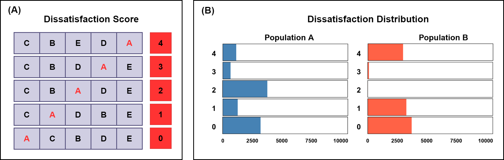

[](https://github.com/Maryam-Shahdoust/ElecMeter/issues) 

[](https://github.com/Maryam-Shahdoust/ElecMeter/releases)


# ElecMeter : an index for Evaluating an Election social Dissatisfaction

</div>


ElecMeter is an index for measuring voter dissatisfaction in single-winner elections. The core idea is to assign each voter a dissatisfaction score based on the rank position of the winning candidate (see Figure, part A). These individual scores are then aggregated into a distribution (see Figure, part B), which is compared against several benchmark distributions using the Jensen–Shannon divergence. The benchmarks represent ideal, maximally dissatisfied, neutral, and polarized patterns, reflecting theoretically meaningful extremes and transitional states of possible dissatisfaction distributions.
The ElecMeter Index combines the average voter dissatisfaction score with the most extreme divergence-based index through a generalized mean formulation (for details, see ElecMeter: An Index for Evaluating Electoral Social Dissatisfaction). This approach captures both the magnitude and the structural pattern of dissatisfaction within the electorate.
Below, you can see the dissatisfaction index computed by ElecMeter for two populations corresponding to the distributions shown in the figure above.

# An Example of Calculating the Dissaisfaction of the results of voting using ElecMeter Index:
Suppose there is population with size 10000. The vo


## Dissatisfaction Distribution Simulation

This repository provides R code to simulate dissatisfaction distributions in ranking/voting scenarios with multiple candidates. The main function SimPopulation() generates dissatisfaction profiles for simulated populations under probabilistic models.

📖 **Scenario:**

Imagine we have K candidates in an election (or ranking system). Every population produces rankings of candidates. Since different voting methods may yield different winners, we want to compute the dissatisfaction distribution for all possible winners.

Dissatisfaction of a candidate = distance of that candidate’s position from the top in a ranking (0 = first place, 1 = second place, …).

By simulating multiple populations, we obtain the distribution of dissatisfaction levels under different possible outcomes.

⚙️ **Methodology:**

The simulation follows these steps:

- **Generate all possible rankings (permutations):** For K candidates, there are K! permutations. For example, with K = 5, we get 120 permutations.
  ```bash
    # define candidates
  candidates <- LETTERS[1:number_candidates]
  # get the list of all permutations
  library(combinat)
  PP <- permn(candidates)
  PP <- matrix(unlist(PP),length(PP),length(candidates),byrow=T)
  PP <- PP[order(PP[,1], decreasing = FALSE),]
  ```
- **Simulate ranking frequencies per population:** Populations of size N are simulated using a multinomial distribution.
The probability vector for the multinomial is drawn from a Dirichlet distribution. The Dirichlet parameter(α) is randomize. Each run uses a random α chosen from {0.05, 0.01, 0.25, 0.5, 1, 2, 3}.
```bash
### Generate the number of permutations per sample : multinomial sample
require(dirmult)
require(HMP)
#in Multinomial code : The first number is the number of reads and the second is the number of subject
set.seed(100000)
freqs<-c()
for(i in 1:groups){
  nrs    <- population_size
  alpha <- sample(c(0.05,0.01,0.25,0.5,1,2,3),replace=FALSE,size=1,rep(0.15,7))
  #alpha  <- 1
  P      <- rdirichlet(1,rep(alpha,dim(PP)[1]))
  freqs  <- rbind(freqs,Multinomial(nrs,P))
      }

names <- cbind(sort(rep(LETTERS[1:number_candidates],times=dim(PP)[1]/number_candidates)),rep(1:(dim(PP)[1]/number_candidates),times=number_candidates))
colnames(freqs) <- paste(names[,1],names[,2])
rownames(freqs) <- c(paste("pop",1:groups,sep=''))

```
-  ***Calculate dissatisfaction scores:*** Each candidate is considered as the winner and for each permutation, dissatisfaction of a candidate is calculted as its rank position − 1.
``` bash
#Diss indicates the distance of each candidate to the top position in each permutation
Diss <- data.frame()
for ( i in 1:dim(PP)[1]){
for ( j in 1:length(candidates)){
      Diss[i,j] <- which(PP[i,]== candidates[j])-1
  }}

colnames(Diss) <- LETTERS[1:number_candidates]
# each column represents a winner candidate.
x    <- list()
info <- array(x,groups)

for ( i in 1:groups) {
  info[[i]]           <- cbind(freqs[i,],Diss[,1:length(candidates)])
  colnames(info[[i]]) <- c('freq',LETTERS[1:number_candidates])
}
```

- ***Assign winners & aggregate dissatisfaction:*** Dissatisfaction values are weighted by permutation frequencies. Dissatisfaction distributions are built by computing how often each dissatisfaction level (0 to K-1) appears for each candidate and each population.
``` bash
###Distribution of DisSatisfaction
dist <- array(0,c(number_candidates,number_candidates,groups))
colnames(dist) <- LETTERS[1:number_candidates]
rownames(dist) <- seq(0,number_candidates - 1)

for (i in 1:groups){
for (j in 1:length(candidates)) {
  dist[,j,i] <- aggregate(.~info[[i]][,j+1],data=info[[i]][,c(1,j+1)],FUN=sum)[,2]
    }
}
sim_results <- list(candidates,PP,freqs,info,Diss,dist)
```


***🚀 Usage:*** This generates dissatisfaction distributions for: 5 candidates, across one populations with 1000 individuals.
``` bash
results <- SimPopulation(number_candidates = 5,
                         groups = 1,
                        population_size = 1000)
```
The final dissatisfaction distributions are like this:
    A   B   C   D   E
0 185 181 199 210 225
1 172 194 242 205 187
2 204 184 181 216 215
3 251 223 185 173 168
4 188 218 193 196 205


***📊 Outputs:***

The function returns a list with:

candidates → Candidate labels.

PP → All candidate permutations.

freqs → Frequencies of permutations per population.

info → Dissatisfaction values and frequencies per population.

Diss → Dissatisfaction scores for each candidate in each permutation.

dist → Final dissatisfaction distributions (per candidate, per population).


